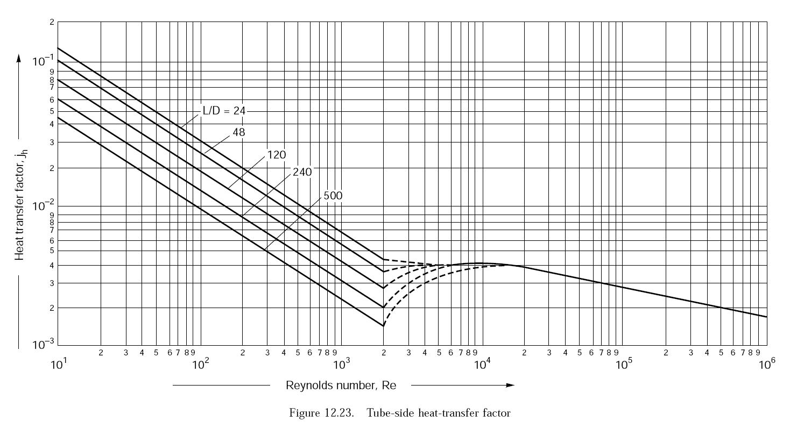
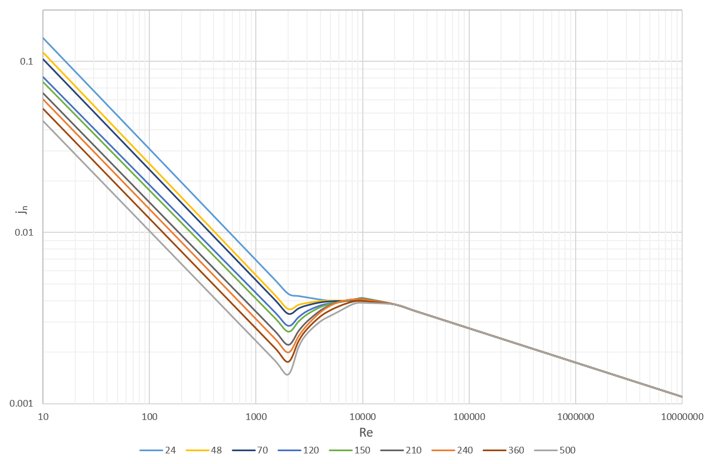

### Usage
---
```vbnet
=JnTubeSide(L/D, Re) 'calculates the tube side heat transfer coefficient

=JnShellSide25(Re)	 'calculates the shell side heat transfer coefficient (for a 25% baffle cut)
```
Where `Re` is Reynold's number, and `L/D` is the `length:diameter` ratio of the tubes.

### Installation
---
Import the module into Excel: `Developer -> Visual Basic -> File -> Import File`

---
### Comparison





---
